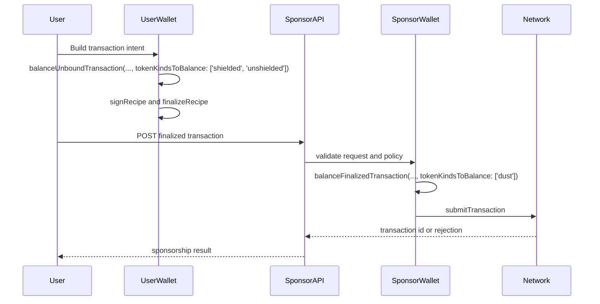

<!--
This file is part of contributor-hub.
Copyright (C) 2026 Midnight Foundation
SPDX-License-Identifier: Apache-2.0
Licensed under the Apache License, Version 2.0.
-->

# DUST sponsorship on Midnight

DUST sponsorship lets a service pay the transaction fee for a user without taking
over the user's proof, wallet identity, or contract-level authority. The user
still builds the transaction with their own wallet context. The sponsor only adds
DUST for fees and then submits the finished transaction.

This tutorial uses the current Wallet SDK concepts documented in the Midnight
wallet developer guide: `WalletFacade`, the unshielded, shielded, and DUST wallet
roles, `balanceUnboundTransaction`, `balanceFinalizedTransaction`,
`finalizeRecipe`, `signRecipe`, and `submitTransaction`. The official packages
for these operations are `@midnight-ntwrk/wallet-sdk-facade`,
`@midnight-ntwrk/wallet-sdk-unshielded-wallet`,
`@midnight-ntwrk/wallet-sdk-shielded`,
`@midnight-ntwrk/wallet-sdk-dust-wallet`, `@midnight-ntwrk/wallet-sdk-hd`,
`@midnight-ntwrk/wallet-sdk-address-format`, and `@midnight-ntwrk/ledger-v8`.

The important API shape is the balancing option:

```ts
{
  ttl: new Date(Date.now() + 30 * 60 * 1000),
  tokenKindsToBalance: ['dust'],
}
```

Use that option only at the sponsorship step. The user side should not ask its
wallet to add DUST if the user has none.

## When to use sponsorship

Sponsorship is useful when a DApp wants a smoother first transaction for users
who do not yet have DUST, or when an operator wants to subsidize a specific
workflow. It is not a direct DUST transfer pattern. The sponsor is not sending
spendable DUST to the user. Instead, the sponsor wallet contributes DUST inputs
to one transaction it is willing to pay for.

The sponsor also does not become the contract caller merely by paying fees. If a
Compact circuit calls `ownPublicKey()`, it retrieves the Zswap coin public key of
the user executing the circuit. In a sponsored flow, that should be the prover's
key from the user's transaction-building context, not the sponsor's DUST key. Do
not write contract authorization logic that assumes the fee payer is the actor.

## Flow

The current Wallet SDK documentation describes a three-step two-party flow: the
user balances non-DUST token kinds, the sponsor adds DUST to the finalized
transaction, and the sponsor submits it.



If your service owns an unbound transaction construction path internally, the
same sponsor-only restriction applies with `balanceUnboundTransaction`:

```ts
const dustOnlyRecipe = await sponsorWallet.balanceUnboundTransaction(
  unboundTransaction,
  { shieldedSecretKeys: sponsorShieldedKeys, dustSecretKey: sponsorDustKey },
  {
    ttl: new Date(Date.now() + 30 * 60 * 1000),
    tokenKindsToBalance: ['dust'],
  },
);
```

For a normal user-to-sponsor handoff, prefer the documented
`balanceFinalizedTransaction` shape because the user's proofs and signatures have
already been produced before the sponsor receives the transaction.

## User-side preparation

The user wallet starts from a transaction intent created by the DApp. That may be
a contract call, shielded transfer, or another wallet-supported operation. The
user wallet should balance only the token kinds the user is responsible for:

```ts
const userRecipe = await userWallet.balanceUnboundTransaction(
  transaction,
  { shieldedSecretKeys: userShieldedKeys, dustSecretKey: userDustKey },
  {
    ttl: new Date(Date.now() + 30 * 60 * 1000),
    tokenKindsToBalance: ['shielded', 'unshielded'],
  },
);

const userSigned = await userWallet.signRecipe(userRecipe, (payload) =>
  userKeystore.signData(payload),
);

const userFinalized = await userWallet.finalizeRecipe(userSigned);
```

The `userFinalized` value is what the client sends to the sponsor service. Keep
the request small and explicit. Include the serialized finalized transaction, an
idempotency key, the expected network, and any DApp-level context the sponsor
uses for policy checks. Do not include private keys or local wallet state.

## Sponsor service

A sponsor service has three jobs: validate, balance DUST only, and submit. The
example below uses structural types so the flow is clear. In a real service,
`wallet` is a `WalletFacade` created from the official Wallet SDK packages and
initialized with the sponsor's shielded and DUST keys.

```ts
type TokenKind = 'shielded' | 'unshielded' | 'dust';

type BalanceOptions = {
  ttl: Date;
  tokenKindsToBalance: TokenKind[];
};

type SponsorWallet = {
  waitForSyncedState(): Promise<{ dust: { totalCoins: bigint } }>;
  balanceFinalizedTransaction(
    finalizedTransaction: unknown,
    secretKeys: { shieldedSecretKeys: unknown; dustSecretKey: unknown },
    options: BalanceOptions,
  ): Promise<unknown>;
  signRecipe(recipe: unknown, sign: (payload: Uint8Array) => Promise<Uint8Array>): Promise<unknown>;
  finalizeRecipe(recipe: unknown): Promise<unknown>;
  submitTransaction(transaction: unknown): Promise<string>;
};

async function sponsorTransaction(input: {
  wallet: SponsorWallet;
  finalizedTransaction: unknown;
  sponsorShieldedKeys: unknown;
  sponsorDustKey: unknown;
  signSponsorPayload: (payload: Uint8Array) => Promise<Uint8Array>;
}) {
  const synced = await input.wallet.waitForSyncedState();
  const visibleDust = synced.dust.totalCoins;

  if (visibleDust <= 0n) {
    throw new Error('SPONSOR_DUST_UNAVAILABLE');
  }

  const recipe = await input.wallet.balanceFinalizedTransaction(
    input.finalizedTransaction,
    {
      shieldedSecretKeys: input.sponsorShieldedKeys,
      dustSecretKey: input.sponsorDustKey,
    },
    {
      ttl: new Date(Date.now() + 30 * 60 * 1000),
      tokenKindsToBalance: ['dust'],
    },
  );

  const signed = await input.wallet.signRecipe(recipe, input.signSponsorPayload);
  const ready = await input.wallet.finalizeRecipe(signed);

  return input.wallet.submitTransaction(ready);
}
```

Production services should add request authentication, per-user and global rate
limits, idempotency storage, input size limits, network checks, and a policy
layer that decides which contract calls are eligible. Do those checks before
balancing. The sponsor should never pay for an opaque transaction just because it
is syntactically valid.

## The `ownPublicKey()` caveat

`ownPublicKey()` is a Compact runtime function. It returns the Zswap coin public
key for the user executing the circuit. Sponsorship does not make the sponsor the
executor of the user's private circuit. The sponsor is a fee payer at the wallet
transaction layer.

That distinction affects authorization. If your contract stores an owner key and
checks it against `ownPublicKey()`, the check should still evaluate against the
user who proved the circuit. If the sponsor's key appeared there, sponsorship
would accidentally change the actor. That is not the model you should design
for. Keep sponsor policy outside the circuit, and keep user authority inside the
user's proof and signatures.

## What each side can see

The user can see their own wallet state, private inputs, and whether the sponsor
accepted or rejected the request. The user should not be able to inspect the
sponsor's DUST balance unless the sponsor chooses to publish service health.

The sponsor can see what is present in the finalized transaction and the metadata
the client sends to the API. The sponsor cannot recover the user's private
witnesses or local private state from the sponsorship request. Because DUST is
managed by the DUST wallet, only the wallet with the relevant DUST secret key can
check that wallet's DUST balance directly.

## Service boundaries

Keep the sponsorship API boring. A useful endpoint is `POST /sponsor` with a
body containing `{ idempotencyKey, networkId, finalizedTransaction }`. The
response can be `{ requestId, transactionId }` on success or a stable error code
on failure. Idempotency matters because clients may retry after a timeout while
the original request is still being balanced or submitted. Store the request id
with the transaction hash once submission succeeds.

The sponsor should also expose a coarse health endpoint, such as
`GET /sponsor/health`, but avoid publishing exact wallet balances unless your
operations policy requires it. A simple `available`, `limited`, or `unavailable`
status is usually enough for clients to decide whether to submit a request or
ask the user to try later.

## DUST generation, depletion, and recovery

DUST is required for transaction fees and is generated from registered NIGHT
holdings. The Wallet SDK guide shows registration with
`registerNightUtxosForDustGeneration`, after which generation begins once the
blockchain processes the registration. The guide also shows that wallet state can
report DUST with `state.dust.balance(new Date())`.

Avoid hard-coding economic constants or promising a number of sponsored
transactions per NIGHT unless you have current network parameters from an
official source for the environment you are targeting. For operational code,
treat DUST as capacity that can be available, low, or unavailable. If the sponsor
wallet has registered NIGHT and no DUST yet, wait for generation. If DUST was
spent faster than it is generated, reject or queue sponsorship requests until the
wallet reports enough DUST again. If the service has no registered NIGHT
generating DUST to the sponsor's DUST address, there is nothing for the sponsor
wallet to add.

## Expected failure modes

`SPONSOR_DUST_UNAVAILABLE`: the sponsor wallet is synced but reports no usable
DUST for the request. Retry only after the sponsor reports capacity.

`UNSUPPORTED_NETWORK`: the request targets a network other than the sponsor's
configured network, such as mixing Preview and Preprod.

`POLICY_REJECTED`: the transaction is outside the sponsor's allowlist, exceeds a
per-user quota, or is missing required DApp metadata.

`TX_EXPIRED`: the transaction TTL was too short or the sponsor processed it too
late.

`BALANCING_FAILED`: the SDK could not add DUST inputs, often because DUST changed
while the request was waiting or the transaction was already unsuitable for
balancing.

`SUBMISSION_REJECTED`: the node rejected the transaction after finalization.
Return the rejection category and let the user rebuild a fresh transaction.

## Validation

For the companion example in this repository:

```sh
cd examples/dust-sponsorship
npm install
npm run typecheck
npm test
```

For a real Wallet SDK integration, also run your normal Midnight application
tests against the target environment, start from a synced sponsor wallet, verify
that the user can submit a zero-DUST request, and verify that the same request
fails cleanly when the sponsor wallet reports no DUST.

## Checklist

Before using sponsorship in production:

- Initialize the sponsor wallet from official Wallet SDK packages.
- Confirm the sponsor is synced before balancing or submitting.
- Balance only `['dust']` in the sponsor step.
- Keep user proof generation and `ownPublicKey()` authority with the user.
- Limit sponsorship to known transactions and known networks.
- Log request ids and transaction ids, not private wallet state.
- Return clear retry guidance for DUST, TTL, balancing, and submission failures.

## References

- Midnight Wallet SDK guide:
  <https://docs.midnight.network/sdks/official/wallet-developer-guide>
- `ownPublicKey()` Compact runtime reference:
  <https://docs.midnight.network/api-reference/compact-runtime/functions/ownPublicKey>
- Midnight compatibility matrix:
  <https://docs.midnight.network/relnotes/support-matrix>
- Programmatic DUST generation guide:
  <https://docs.midnight.network/guides/generating-dust-programmatically>
